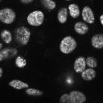
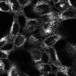
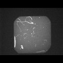
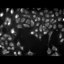
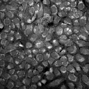
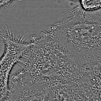
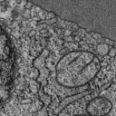

# Dataset guide

These six datasets provide seven raw inputs for microscopy compression
benchmarks. Shapes below are `[plane, y, x]`; sizes describe the included
samples. Thumbnails use display contrast adjustments. Pixel values in the
raw files retain their source representation.

See [README.md](README.md) for downloads, [manifest.json](manifest.json) for
source metadata and checksums, and [DATA-LICENSES.md](DATA-LICENSES.md) for
complete credits and license notices.

## OpenCell

`uint16` · two files, each `[6, 600, 600]` · **8.24 MiB total**

DNA and tagged-protein fluorescence from human cells. Each file contains
six selected source planes, preserving the original pixel values. Previews
show DNA followed by protein.

Credit: [OpenCell](https://registry.opendata.aws/czb-opencell/) team, Chan
Zuckerberg Biohub; [Cho et al.](https://doi.org/10.1126/science.abi6983).
[CC BY-SA 4.0](https://creativecommons.org/licenses/by-sa/4.0/).

## BBBC010

`uint16` · `[1, 520, 696]` · **0.69 MiB**

One complete brightfield image of *C. elegans* from well C05 of a live/dead
assay. The sample preserves the source TIFF pixels and provides worm shapes
and texture for compression comparisons.

Credit: Fred Ausubel's laboratory, Massachusetts General Hospital, and the
[Broad Bioimage Benchmark Collection](https://bbbc.broadinstitute.org/BBBC010).
[CC0](https://creativecommons.org/publicdomain/zero/1.0/).

## BBBC022

`uint16` · `[16, 520, 696]` · **11.04 MiB**

MitoTracker Deep Red fluorescence from 16 control wells on one U2OS Cell
Painting plate. Each plane is a separate complete field, acquired with
matching 300 ms exposures. Original noisy pixels are preserved.
[Selection and import details](docs/bbbc022.md).

Credit: [Gustafsdottir et al.](https://doi.org/10.1371/journal.pone.0080999)
and the [Broad Bioimage Benchmark Collection](https://bbbc.broadinstitute.org/BBBC022).
[CC0](https://creativecommons.org/publicdomain/zero/1.0/).

## JUMP-Scope

`uint16` · `[1, 2000, 2000]` · **7.63 MiB**

One complete Cell Painting fluorescence field from a Yokogawa CQ1 microscope,
using the 640 nm channel. The source acquisition records flat-field and
geometric calibration; the import preserves its published pixels.

Credit: JUMP Cell Painting Consortium and Broad Institute;
[Tromans-Coia, Jamali et al.](https://doi.org/10.1002/cyto.a.24786) and the
[Cell Painting Gallery](https://broadinstitute.github.io/cellpainting-gallery/citing.html).
[CC0](https://creativecommons.org/publicdomain/zero/1.0/).

## DynaCell A549

`float32` · `[1, 512, 512]` · **1 MiB**

One full plane from the provider's `Phase3D` reconstruction of A549 cells,
from the mock condition and field `fov0006`. The sample preserves the
floating-point phase values without rescaling.

Credit: Alexandr A. Kalinin and colleagues, the
[DynaCell team](https://registry.opendata.aws/dynacell/), and Shalin B. Mehta's
Computational Imaging Group at Biohub.
[CC BY 4.0](https://creativecommons.org/licenses/by/4.0/).

## COSEM

`uint8` · `[32, 1024, 1024]` · **32 MiB**

Thirty-two distinct depth planes from a reconstructed COS-7 FIB-SEM volume.
Each plane supplies 1 MiB of pixels; chunks can span multiple planes.
Neighboring depths retain natural spatial correlation.
[Selection and import details](docs/cosem.md).

Credit: [OpenOrganelle / COSEM](https://registry.opendata.aws/janelia-cosem/),
CellMap Project Team at HHMI Janelia, and the
[COS-7 dataset contributors](https://figshare.com/articles/dataset/24898086).
[CC BY 4.0](https://creativecommons.org/licenses/by/4.0/).
